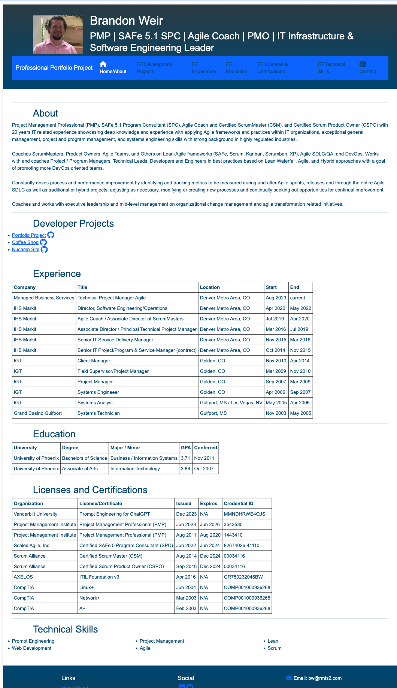
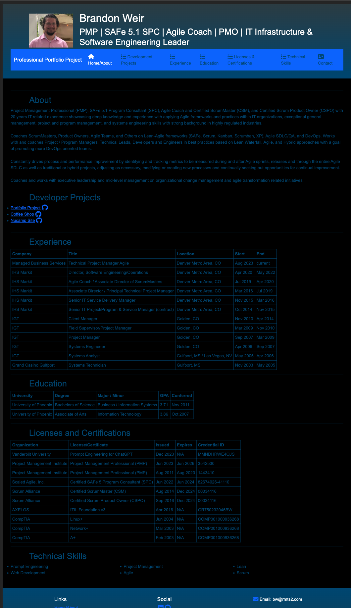

# Portfolio Project

## Description

This is my first attempt at building my own professional portfolio. This is to highlight my coding skills as they develop and to show potential employers and clients what I can do for them.

## License

You are free to use my code as an example but please give me credit!

## Screenshots

### Light Mode

### Dark Mode
